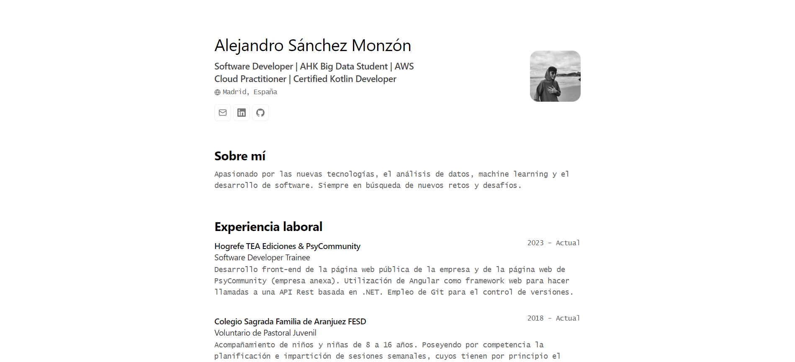

# Alejandro Sánchez Monzón - Portfolio Personal

¡Hola! Bienvenido a mi portfolio personal. Este sitio web ha sido creado con Astro, un moderno generador de sitios front-end que te permite construir sitios web más rápidos.

## Acerca de este Portfolio

Este portfolio es una representación minimalista de mi trabajo y experiencia en el mundo del desarrollo de software. Aquí encontrarás una selección de mis proyectos más destacados, así como información sobre mis habilidades, experiencia y educación.

## Preview

## Proyectos Destacados

En la sección de proyectos de este portfolio, podrás ver una selección de mis trabajos más destacados. Cada proyecto incluye una descripción detallada, tecnologías utilizadas y enlaces a los repositorios de código y versiones.

## Referencias

* Esquema del JSON de CV de [jsonresume.org](https://jsonresume.org/schema/).

* Basado en el diseño de [Bartosz Jarocki](https://github.com/BartoszJarocki/cv).

* Desarrollo basado en el repositorio de [@midudev](https://github.com/midudev).
